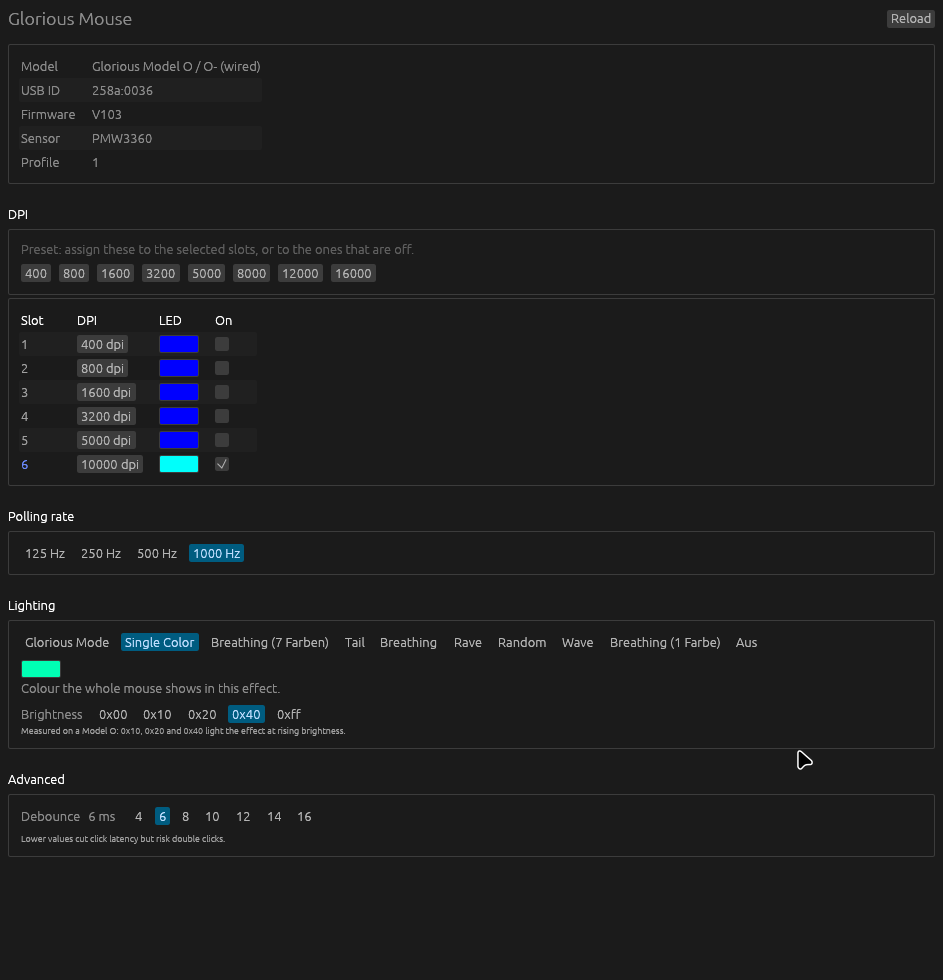

# glorious-rs

Open source configuration app for the **Glorious Model O and Model O- wired
mice** (2019). It exists because Glorious discontinued *Glorious Model O
Software v1.0.9* and the replacement was a Windows-only application, which left
the mouse configurable only on a system it was not sold for.



**This project was written entirely with AI assistance.** The protocol is
undocumented, so every offset in here was found by experiment against a real
mouse: writing a value, reading the configuration blob back, and in the case of
the lighting, photographing the mouse with a camera to see what it actually did.
That method produced four wrong answers in this codebase, each of which looked
settled for a while:

- **The colour channels are red, blue, green, not red, green, blue.** The first
  measurement tested red alone, concluded the ordinary order, and swapped green
  and blue in the process. Removing the swap made every green setting come out
  blue, the same error seen from the other side.
- **The mode bytes are not speed and brightness packed into a nibble pair.**
  That came from the ratbag driver. Sweeping byte 56 lit the effect at rising
  brightness while its low nibble changed nothing visible, so only the upper
  nibble is a brightness.
- **Bytes 61 to 81 are not the seven colours of the seven colour breathing
  effect.** With all twenty-one at their maximum the effect still never shows
  red or green. An effect that ignores its own colour table is not reading that
  table.
- **Glorious Mode reads the DPI slot colours, not the solid colour bytes.** With
  every slot blue and `ff8800` in bytes 57 to 59, the mouse stayed blue.

Each correction is written down at the byte it applies to below, and the
comment in the source says the same. Treat this as hardware reverse engineering
with an assistant, not as reviewed production code. Every claim in this file was
measured on a wired Model O, 258a:0036, firmware V103, but the measurement setup
is not reproduced here. Verify before relying on it.

The USB protocol is documented in [PROTOCOL.md](PROTOCOL.md), including which
parts were measured on real hardware and which are still open.

## What it does

- Reads sensor, report rate, debounce, the DPI slots and their LED colours
- Writes DPI, slot enable, slot colour, report rate, lighting effect, the
  brightness of the effect, the colour of a solid lighting effect, and debounce
- Offers the ten lighting effects that work on this mouse, with the names the
  vendor software uses
- Shows device name, USB ID, firmware and the active onboard profile

Glorious Mode takes its colours from the six DPI slot colours, measured: set all
six red and the mouse went red. The solid colour editor is hidden for it and the
slots are where the colours are set. The seven colour breathing is treated the
same way, on the strength of what it is named rather than on a measurement of
its own; see [Open questions](#open-questions).

Button remapping, macros and lift-off distance are not implemented yet.

## Building

```sh
cargo build --release                 # native binary
cargo test                            # protocol tests, no hardware needed
./packaging/build-appimage.sh         # AppImage, needs appimagetool
```

Cross compiling to Windows needs the GNU target:

```sh
rustup target add x86_64-pc-windows-gnu
cargo build --release --target x86_64-pc-windows-gnu
```

## Linux setup

The mouse exposes its configuration through `hidraw`, which is root-only by
default. Install the udev rule once:

```sh
sudo cp udev/70-glorious-oss.rules /etc/udev/rules.d/
sudo udevadm control --reload-rules && sudo udevadm trigger
```

Then unplug the mouse and plug it back in. The rule needs the `70` prefix: udev
applies rules in name order and the seat rules that grant `uaccess` run at `73`,
so a rule named later would have no effect.

## Command line

```
glorious-rs                              open the window
glorious-rs --dpi                        print the current settings and exit
glorious-rs --dump-config                print the raw 520 byte report with offsets
glorious-rs --set-effect N [RRGGBB] [BB] set a lighting effect, its colour, its brightness
glorious-rs --set-colour N RRGGBB        set the colour of a DPI slot
glorious-rs --calibrate-length           find the value the firmware wants in byte 3
```

The brightness is a whole mode byte, because only its upper nibble was measured:
the lower one changed nothing visible at 16, 32 or 64 and is carried through
from the device. It lands in byte 56 for a solid effect and in byte 60 for the
seven colour breathing. An effect with no measured brightness field refuses the
value instead of writing it somewhere unmeasured, and effect 6 is refused
outright because it leaves the LEDs dark.

## How it talks to the mouse

The protocol is not documented by the manufacturer. What follows was measured on
a real Model O, and each item exists because the obvious implementation fails in
a way the device does not report.

**The reports live on two different handles.** A SinoWealth mouse is a composite
HID device. The 6-byte command register and the 520-byte configuration blob are on
separate collections of the same interface, and both report the same VID and PID.
Opening only one handle gives reads that never change or writes that fail
silently, so both are opened and every transfer is routed by report id.

**A short transfer is dropped without an error.** The configuration report is
always 520 bytes. Sending only the meaningful part of it is accepted by the API
and ignored by the firmware, so the write silently does nothing.

**One transfer, not two.** Writing a command report to select the configuration
and then sending the blob makes the firmware treat the blob as the answer to that
command and discard it. The driver sends the blob on its own, and so does this.

**Byte 3 has to be 122.** The driver writes `config_size - 8`, which for the
largest model in the family is 159, not the 122 this device stores. The value
was found by writing one field, reading it back and restoring, for each
candidate. Several values are accepted and several blank the whole
configuration, without saying so.

**Only the bytes that are understood may be written.** A field whose meaning is
not known has to keep whatever the device reported. Writing zero into it clears
a setting the user never touched, and the device accepts that without comment:
this is how an early version of this tool cleared the lighting of a real mouse.

**A read right after a write returns the old values.** The window therefore
reports what it just wrote, and a reload from the device confirms it.

### The lighting block, byte by byte

#### Byte 53 selects the effect

Values 0 to 10. 0 turns the LEDs off, 2 holds one colour, and 1, 3, 4, 5, 7 and
9 change colour over time while 10 changes brightness without changing hue.

Value 8 is the exception that was expected to animate and does not: across
repeated photographs it stays inside the blue to cyan range. The driver does not
offer it either. It is decoded and offered, because it does light the mouse, but
it is not the colourful effect the name suggests.

Value 6 leaves the LEDs dark on this mouse and the vendor software does not
offer it either. It is still decoded, so a profile written elsewhere shows
`Constant` honestly instead of as an unknown byte, but it is never offered in the
menu and never written: selecting it is indistinguishable from a hardware
fault. That leaves **ten** effects in the menu, not eleven. `RgbEffect::offered`
returns ten, and the count is enforced there rather than in the UI.

#### Byte 56 is the brightness of the solid effects, upper nibble only

Measured by writing one value at a time and photographing the mouse after each:

| byte 56 | what the mouse does | red channel of the lit strip |
|---|---|---|
| `0x01` `0x02` `0x04` `0x08` | LEDs stay dark | — |
| `0x10` | still dark to the eye, at the threshold | 231 |
| `0x20` | lit at about half | 234 |
| `0x40` | fully lit | 248 |

`0x10` is where the scale starts: the strip is measurable there but not yet
visible. The lower nibble made no visible difference at any of those values. The
field is brightness in the high nibble and nothing measured in the low one, which
is why the brightness control only offers the steps `0x00`, `0x10`, `0x20`, `0x40`
and `0xff` and why the device's low nibble is carried through untouched.

This contradicts the ratbag driver's packing of speed and brightness into a
nibble pair, which is what an earlier version of this code implemented. A real
Model O stores `0x40` in this byte with the vendor defaults; `0x13`, the value
the driver packing implies, was a guess and is gone.

#### Byte 60 is the brightness of the seven colour breathing, upper nibble again

Counting photographs taken about a second apart, and counting how many of
eighteen show the mouse lit at all:

| byte 60 | frames lit out of 18 | peak lit pixels |
|---|---|---|
| `0x00` | 1 | 1171 |
| `0x40` | 2 | 820 |
| `0xff` | 4 | 1508 |

The peak pixel count does not rise with the value, which is why the measurement
counts frames and not brightness: a breathing effect needs a series of frames,
and its lit strip measured between 32 and 1890 pixels on frames a second apart.
A higher value makes it lit on more of those frames, not brighter within one.

A real Model O stores `0x42` here with the vendor defaults.

#### Bytes 57 to 59 are the colour a solid effect shows

The device stores colours as **red, blue, green**. Writing `00ff00` produces a
blue mouse, writing `0000ff` produces a green one, and writing `ff0000` produces
a red one. Each of those was checked on a photograph of the device, not on a
read back from it.

Red is the trap in a test like this: it is the one channel a swap does not touch,
so a tool with the order backwards still shows red correctly and looks right. The
first measurement of this field tested red alone, concluded the ordinary order,
and swapped green and blue in the process. Red alone proves nothing here; a
channel pair decides it.

The conversion applies to writing only. A colour read back from the device is
already in the device's order, and swapping it on the way out would undo the swap
on the way in.

#### Byte 54 sets the gradient direction, and is measured but not written

Swept one value at a time under Glorious Mode, with a photograph after each:
0 puts blue at the front and green at the back, 128 reverses it, 255 puts red at
the front. Under the solid effects byte 54 makes no difference, which is why it
only means something in one of them.

It is still carried over from the device untouched. No path in the app changes
it, and the field a profile is built from defaulted to `0x13`, while a real Model
O stores `0x41` there. A default that differs from what the hardware ships with
is not a measurement: writing the field would silently replace a value the
vendor chose with one derived from a driver guess. It is measured, understood,
and deliberately not written.

#### Byte 55 does nothing that could be seen

Swept at 0, 64, 128 and 255 under Glorious Mode with a photograph after each: no
visible difference at any of them. It is carried over from the device untouched,
on the same grounds as byte 54 — there is nothing to map it to, and a field this
code does not understand has to keep whatever the device reported.

#### Bytes 61 to 81 are not the seven colours of the breathing effect

The driver says these twenty-one bytes are the colour table of the seven colour
breathing. The device does not read them as one. The test that settles it:

- all twenty-one bytes at **0**: the breathing effect still runs, cycling
  through blue, magenta and white.
- all twenty-one bytes at **255**: the effect still runs and never shows red or
  green, although every byte was at its maximum.

An effect that ignores its own colour table is not reading that table, so the
seven colours live somewhere that has not been found.

Two claims in the 1.0.0 documentation are contradicted by these measurements and
are dropped here:

- *"Zeroing 61 to 120 lets the effect run for a few frames and then the LEDs go
  out."* It does not: with all twenty-one bytes at zero the effect keeps
  running. What was measured is narrower — leaving **byte 61 alone at zero**,
  with the rest of the range held, lets the effect run a few frames and then the
  LEDs go out. The whole range and byte 61 are not the same finding.
- *"Setting 69 to 75 on its own still gives a lit and slowly changing mouse."*
  Not repeated here: the range was swept in a later run as 61 to 68, and nothing
  was measured at 69 to 75.

What the range does do: setting bytes 61 to 68 on their own gives a mouse that
glows and changes slowly. The effect is controlled across the whole width of the
span rather than by one byte in it, and no single byte there was found to switch
it on or off. They are carried over from the device untouched, which is what
stops a colour the user set from being written over by a guess.

#### Glorious Mode reads the DPI slot colours

Measured by setting all six slot colours to one value and photographing the
mouse under effect 1:

- all six slots **red**: a red mouse, fading towards the next colour across three
  frames a second apart.
- all six slots **blue**: a warm yellow, which is the blend between the blue slots
  and the colour the effect was already on.
- all six slots **blue** with `ff8800` in bytes 57 to 59: the mouse stayed blue.

So effect 1 takes its colours from the DPI list, not from the solid colour
bytes. That is why the solid colour editor is hidden for it while its colours
still follow the slots.

## Verifying a change

The device does not confirm a write, and reading the blob back does not show
whether the change took effect — the blob comes back as it was before the write.
For anything that touches the LEDs, a camera is the only witness: write a value,
photograph the mouse, compare.

The scripts are in [`tools/`](tools/):

| | |
|---|---|
| `measure.py BILD` | the colour the mouse is showing, from one photograph |
| `probe-byte.sh OFFSET PFAD WERT…` | writes one byte at several values and photographs each |
| `map-effects.sh [Bilder] [Pfad]` | writes each lighting effect in turn and photographs it several times |
| `effects.py [Ordner…]` | tells the recorded effects apart by how much their brightness and hue move |
| `cap.cmd` | takes one frame from the camera, run through `cmd.exe` |

They need WSL, a camera on the host and `ffmpeg` on the Windows side.

**How `measure.py` finds the mouse.** Brightness comes first, then colour. The
mouse is a bright object on a dark desk: its shell measures up to 151 where the
wood around it stays under 30, so a brightness line separates the two and colour
is only looked at inside what is left. Within the bright pixels, the LED is the
one whose channels disagree most — the shell is white however it is lit, and the
room's blue cast in it is the same blue a blue LED makes, so brightness alone
cannot say whether the mouse is on. The result is the average of the **fifteen
strongest** of those pixels, not of all of them: the shell is lit by the LED
beside it and contributes a white cast, so averaging in more pixels dilutes the
colour towards grey. The band of the frame the search covers is a constant in
the script, placed on a photograph of the setup this was measured on: the mouse
filled roughly the middle of it. Move the mouse to a different part of the desk
and the measurement follows the frame rather than the mouse, so check what is
in it before trusting a reading.

**Two limits, both measured rather than assumed.**

Blue, green and cyan are not separable. They measure `(54, 167, 255)`,
`(81, 230, 178)` and `(89, 204, 255)`, and the blue cast of the room sits on
every pixel and is larger than the distance between the three. `measure.py`
reports that group as *green, cyan or blue* rather than picking one. Red and
magenta are reliable: red measured the same value in five runs out of five, with
its red channel between 247 and 252.

The camera sets its exposure from the frame, so a mouse with the LEDs off gives
it a dark frame and there is nothing above the brightness line to find. In a
bright room an unlit mouse is reported as unlit; in a dark one the tool reports
no mouse in the frame, which is a statement about what the camera can see and
not about what is there.

An earlier run of `map-effects.sh` produced a table of what each lighting effect
does, and that table was wrong: the mouse was not in the frame, so the script
measured an empty desk. The only claim from it that survived is the one a user
can see without a camera, that value 6 leaves the LEDs dark. The descriptions of
the other effects are not in this file because they have not been measured
against an image showing the mouse. One measured exception replaces part of it:
value 8 stays inside the blue to cyan range across repeated photographs instead
of changing colour. Running the script writes to the device and leaves the last
effect it wrote selected.

## Open questions

- **Where the seven colours of the seven colour breathing live.** Effect 3 is
  named for seven colours that are not in bytes 61 to 81, where the driver says
  they are. The effect is grouped with Glorious Mode as one that follows the DPI
  list, but that grouping rests on the effect's name and not on a measurement:
  with all six slots one colour and a distinct colour in bytes 57 to 59, only
  Glorious Mode was photographed, and Glorious Mode stayed with the slot colour.
  Whether effect 3 reads the slot colours the same way is untested.
- **What bytes 61 to 81 actually control.** They change the breathing effect
  across the whole 21 byte span, and no single byte in it switches the effect on
  or off. Their structure is unknown, so they are carried over untouched.
- **Byte 55.** Measured at 0, 64, 128 and 255 under Glorious Mode with no
  visible effect. It may mean something under a condition that was not tried.

## Keywords

Searching for a replacement for the vendor tool usually starts with the symptom
rather than the product name, so the terms below are the ones that describe the
problem rather than the project.

**German**

Glorious Model O Alternative, Glorious Model O Software Ersatz, Glorious Model
O Konfigurationssoftware, Glorious Model O open source, Glorious Model O
Einstellungen am PC, Glorious Maus DPI einstellen, Glorious Maus RGB Farbe
ändern, Glorious Model O Beleuchtung, Glorious Model O Software abgeschaltet,
Glorious Model O kein Effekt mehr, Glorious Model O Hersteller Software
abgeschafft, Glorious Model O Treiber funktioniert nicht, Glorious Model O
Farbe wird nicht übernommen, Glorious Model O Glorious Mode ausschalten, Maus
Beleuchtung einstellen Windows, Maus Makro Software, Glorious Model O ohne
Herstellersoftware einstellen, Maus DPI Stufen einstellen, Glorious Model O
Firmware 1.0.9, Glorious Model O anschließen Linux, Glorious Maus hidraw Linux,
HID Feature Report Maus auslesen.

**English**

Glorious Model O open source alternative, Glorious Model O configuration tool
Linux, Glorious Model O software discontinued, replace Glorious Model O
software, Glorious Model O settings on PC, Glorious mouse RGB colour per DPI
slot, Glorious Model O driver not working, Glorious Model O colour not
applying, Glorious Model O Glorious mode disable, Glorious Model O Protocol,
SinoWealth HID protocol, Model O mouse config Linux, mouse DPI profiles open
source, USB HID feature report mouse configuration, Model O replacement
software.

**Related hardware this was tested against**

Glorious Model O wired 258a:0036, Glorious Model O- wired, Glorious Model D,
Glorious Model O Wireless, Glorious Model O Eternal, SinoWealth 0027 and 0036
firmware, PMW3360 sensor.

## Licence

MIT.
